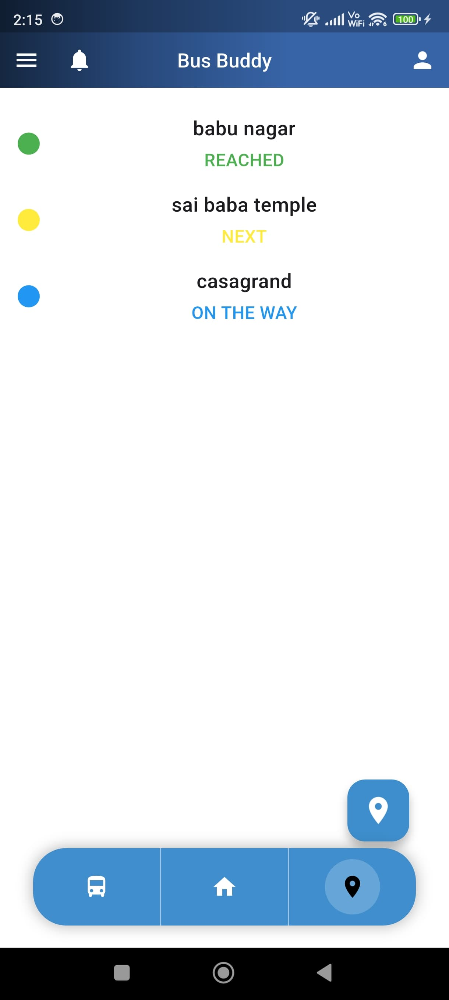
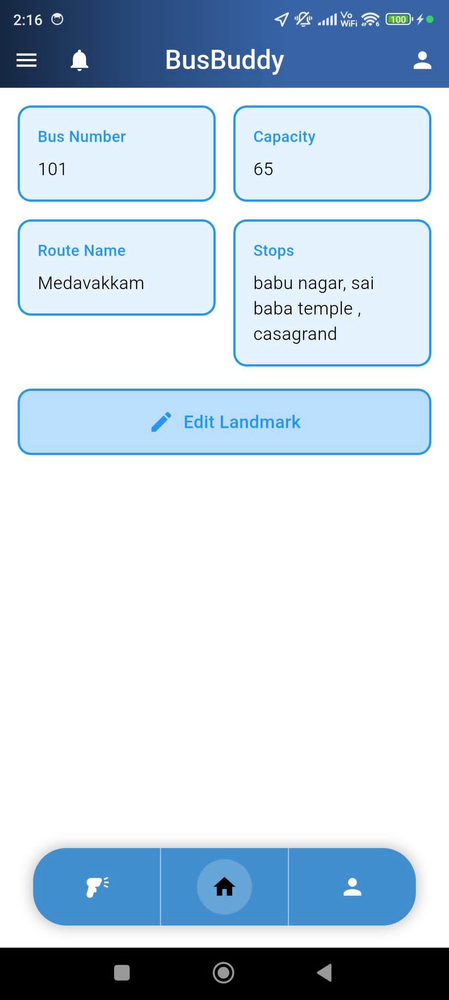
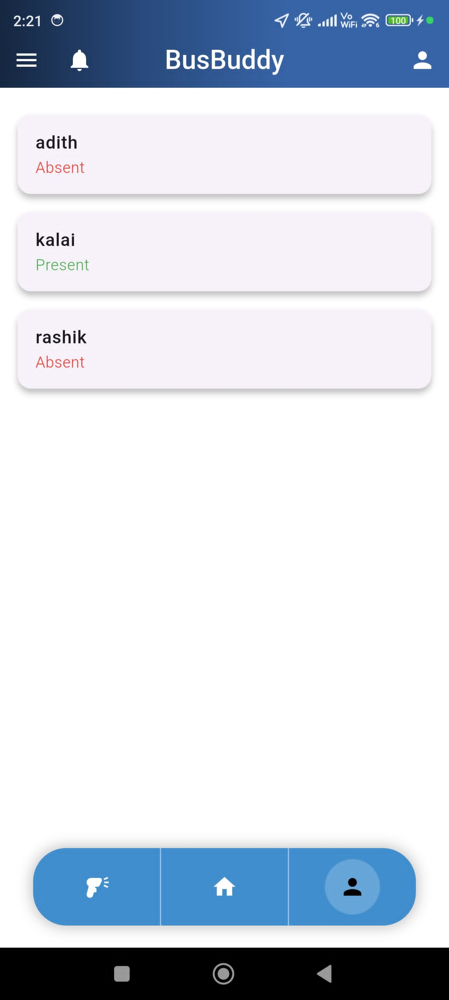
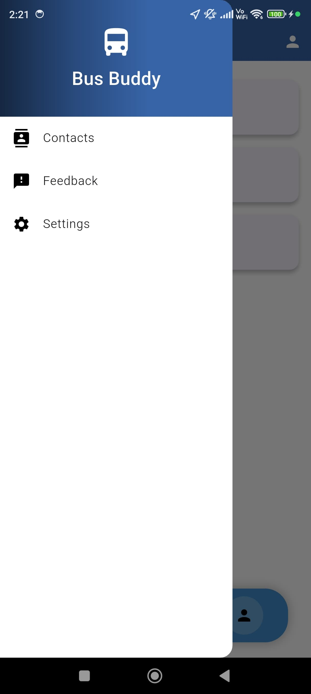

# Bus Management App

## 🚀 Overview
Bus Management App is a Flutter-based application designed to streamline bus assignment management. It allows students to view their assigned buses and enables administrators to efficiently manage assignments.

## 📌 Features
- **User Authentication** (Firebase Authentication)
- **Bus Assignment Management**
- **Firestore Database Integration**
- **Offline & Online Task Management**
- **Bottom Navigation for Easy Navigation**

## 🛠️ Setup & Installation

### Clone the Repository:
```sh
git clone https://github.com/Adith-Senthil-kumar/Bus_management_app.git
cd Bus_management_app
```

### Install Dependencies:
```sh
flutter pub get
```

### Setup Firebase:
1. Download the required Firebase config files:
   - `google-services.json` (for Android)
   - `GoogleService-Info.plist` (for iOS & macOS)
2. Place them in the following directories:
   - **Android:** `android/app/`
   - **iOS:** `ios/Runner/`
   - **macOS:** `macos/Runner/`

### Run the App:
```sh
flutter run
```

## 🔥 Firebase Configuration
Ensure Firebase is set up correctly:
1. Create a Firebase project.
2. Enable Authentication (Email/Google Sign-In, etc.).
3. Set up Firestore Database & Realtime Database as needed.

## 📸 Screenshots
📸 Check out all screenshots here 👉 [Full Gallery](ss.md)
Login page 

<div align="center">
  
</div>  

Admin Portal
<div align="center">
  <table>
    <tr>
      <td></td>
      <td></td>
      <td></td>
      <td></td>
    </tr>
  </table>
</div>  

User Portal
<div align="center">
  <table>
    <tr>
      <td></td>
      <td></td>
      <td></td>
      <td></td>
    </tr>
  </table>
</div>  

Driver Portal
<div align="center">
  <table>
    <tr>
      <td></td>
      <td></td>
      <td></td>
      <td></td>
    </tr>
  </table>
</div>  


## 👨‍💻 Tech Stack
- **Flutter**
- **Dart**
- **Firebase** (Authentication, Firestore, Storage)
- **BLoC Pattern** for State Management

## 🙌 Contributors
- **Adith Senthil Kumar** (Lead Developer)


